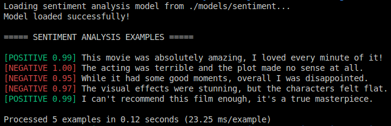

# LLM-Finetuning-Sentiment-Analysis

[](https://www.python.org/downloads/)
[](https://github.com/shane-reaume/LLM-Finetuning-Sentiment-Analysis/blob/main/coverage-badge.json)
[](https://github.com/shane-reaume/LLM-Finetuning-Sentiment-Analysis/actions/workflows/test.yml)
[](LICENSE)
[](https://github.com/shane-reaume/LLM-Finetuning-Sentiment-Analysis/blob/main/challenge-tests-badge.json)

A comprehensive educational project demonstrating transformer-based NLP model fine-tuning with robust QA practices. This repository showcases supervised fine-tuning of DistilBERT for binary sentiment classification, implementing advanced testing methodologies including adversarial examples, edge case handling, and performance benchmarking—all designed for ML practitioners seeking to improve model reliability and evaluation techniques.

## 🎯 What This Project Does

This project demonstrates how to:

- Fine-tune language models for sentiment classification
- Implement proper testing and evaluation methodologies for LLMs
- Create evaluation metrics and test sets for consistent model testing
- Deploy models to Hugging Face Hub as a Transformer model
  - original model: [huggingface.co/shane-reaume/imdb-sentiment-analysis](https://huggingface.co/shane-reaume/imdb-sentiment-analysis)
  - improved model: [huggingface.co/shane-reaume/imdb-sentiment-analysis-v2](https://huggingface.co/shane-reaume/imdb-sentiment-analysis-v2)
- Create interactive demos for testing models

## 📋 System Requirements

- **Python 3.13 or higher**
- **Git** for version control
- **GPU with VRAM**:
  - 8GB+ recommended for sentiment analysis
  - CPU-only training is possible but very slow
- **Basic Python knowledge** (No ML experience required)
- **Platform Compatibility**:
  - ✅ **Windows 11**: Using WSL with Ubuntu
  - ✅ **Linux**: Confirmed on Debian-based distributions like Linux Mint and Ubuntu
  - ❌ **macOS**: Not currently compatible due to PyTorch version requirements
    - Project uses PyTorch 2.6.0, while macOS is limited to PyTorch 2.2.0
    - May work with modifications to `requirements.txt` but not officially supported

## 🔧 Initial Setup

Go to the [GitHub repository](https://github.com/shane-reaume/LLM-Finetuning-Sentiment-Analysis) and Fork the repository or click the "Code" button to clone the repository.

```bash
git clone https://github.com/<your-repo if forked or shane-reaume>/LLM-Finetuning-Sentiment-Analysis.git

cd LLM-Finetuning-Sentiment-Analysis

# Setup env Linux
chmod +x setup_env.sh
./setup_env.sh

# Setup env for WSL Ubuntu
chmod +x setup_env_wsl_ubuntu.sh
./setup_env_wsl_ubuntu.sh
```

This script will:

- Create a virtual environment
- Install all dependencies
- Create necessary project directories

## 🤖 Sentiment Analysis Project



- **Model Architecture**: Fine-tuning a **DistilBERT** encoder model for binary text classification
- **Training Methodology**: Binary classification on the IMDB movie reviews dataset
- **Key Techniques**: Transfer learning, mixed-precision training, supervised fine-tuning
- **Evaluation Metrics**: Accuracy, F1 score, precision, recall
- **Deployment Target**: Published to **Hugging Face Hub**

→ [**Get Started with Sentiment Analysis**](GETTING_STARTED.md)

## 🧪 Testing & Quality Assurance Focus

This project places special emphasis on testing methodologies for ML models. For a comprehensive guide to our testing approach, see [GETTING_STARTED.md#testing-philosophy-and-methodology](GETTING_STARTED.md#testing-philosophy-and-methodology).

### Test Types Implemented

- **Unit tests**: Testing individual components like data loaders
- **Functional tests**: Testing model predictions with known inputs
- **Performance tests**: Ensuring the model meets accuracy and speed requirements
- **Challenging test cases**: Specialized framework for testing difficult examples
- **Balanced test sets**: Creating test data with equal class distribution
- **High-confidence evaluations**: Analyzing model confidence in predictions
- **Memory tests**: Ensuring models can run on consumer hardware

### Testing Principles

- **Reproducibility**: Tests use fixed test sets to ensure consistent evaluation
- **Isolation**: Components are tested independently
- **Metrics tracking**: F1 score, precision, recall, and accuracy are tracked
- **Performance benchmarking**: Measuring inference speed and memory usage
- **Categorized challenges**: Tracking performance on specific types of difficult inputs

### Challenging Test Cases Framework

The project includes a specialized framework for testing model performance on particularly difficult examples:

- **Categorized test cases**: Organized by challenge type (subtle negative, sarcasm, negation, etc.)
- **Performance visualization**: Charts showing model accuracy by challenge category
- **Easy extension**: Tools to add new challenging cases as they're discovered
- **Detailed reporting**: JSON reports and summaries of model weaknesses

### New Testing Infrastructure

The project now includes enhanced testing infrastructure:

- **Comprehensive Test Coverage**: Tracking code coverage with Codecov integration
- **Coverage Reporting**: Detailed HTML reports showing which lines of code are tested
- **Test Improvement Plan**: Structured approach to increasing test coverage (see `TEST_IMPROVEMENT_PLAN.md`)
- **Low Coverage Identification**: Tools to identify files with insufficient test coverage
- **GitHub Actions Integration**: Automated testing and badge generation on every commit
- **Pre-commit Hooks**: Ensuring tests pass before code is committed

## 📊 Example Results

After training the sentiment analysis model, you'll be able to classify text sentiment:

```python
from transformers import pipeline

classifier = pipeline("sentiment-analysis", model="your-username/imdb-sentiment-analysis")
result = classifier("This movie was absolutely amazing, I loved every minute of it!")
print(result)  # [{'label': 'POSITIVE', 'score': 0.9998}]
```

## Next Steps

1. Follow the [Sentiment Analysis Guide](GETTING_STARTED.md)
2. Experiment with your own datasets and models
3. Contribute to the project by adding new test types or model architectures

---

## Project Structure

The project is organized as follows:

- **Sentiment Analysis (DistilBERT)**: A classification task that analyzes movie reviews

- Training: `src/model/sentiment_train.py`
- Inference: `src/model/sentiment_inference.py`  
- Demo: `src/sentiment_demo.py`
- Tests: `tests/test_sentiment_model.py`

The project uses:

- **YAML configurations** in the `config/` directory for model parameters
- **Weights & Biases** for experiment tracking
- **Pytest** for automated testing
- **Hugging Face** for model deployment

## File Structure

```yaml
LLM-Finetuning-Sentiment-Analysis/
├── config/                           # Configuration files
│   └── sentiment_analysis.yaml       # Sentiment analysis training configuration
├── data/                             # Data directories
├── models/                           # Saved model checkpoints
├── src/                              # Source code
│   ├── data/                         # Data processing
│   ├── model/                        # Model training and inference
│   └── utils/                        # Utility functions
├── tests/                            # Automated tests
├── .github/workflows/                # GitHub Actions workflows
├── GETTING_STARTED.md                # Sentiment analysis guide
├── requirements.txt                  # Project dependencies
├── run_tests.sh                      # Script to run all tests
├── run_tests_with_coverage.sh        # Script to run tests with coverage reporting
├── setup_env.sh                      # Environment setup script
├── setup_hooks.sh                    # Git hooks setup script
├── TEST_IMPROVEMENT_PLAN.md          # Plan for improving test coverage
└── update_badge.sh                   # Script to update GitHub Pages badges
```

## Running Tests with Coverage

To run tests and generate coverage reports:

```bash
# Run all tests with coverage reporting
./run_tests_with_coverage.sh

# View the HTML coverage report
open htmlcov/index.html  # On macOS
xdg-open htmlcov/index.html  # On Linux

# Identify files with low coverage
python -m src.utils.identify_low_coverage --threshold 50 --format markdown --output coverage_report.md
```

## Development Workflow

### Branch Strategy

This project uses a two-branch strategy to maintain clean development:

1. **`main` branch**:
   - Production-ready code
   - Protected branch - requires PR approval
   - Badge updates happen here
   - Release versions are tagged from this branch

2. **`develop` branch**:
   - Main development branch
   - Feature branches merge here first
   - Tests run but no badge updates
   - Merges to `main` when ready to release

### Local Development

1. **Start New Work**
   ```bash
   # Ensure you're on develop branch
   git checkout develop
   git pull  # Get latest changes
   
   # Create feature branch
   git checkout -b feature/your-feature-name
   ```

2. **Run Tests Locally First**
   ```bash
   # Activate virtual environment
   source venv/bin/activate
   
   # Run tests with coverage
   ./run_tests_with_coverage.sh
   ```

3. **Standard Git Workflow**
   ```bash
   # Check status of your changes
   git status
   
   # Stage your changes
   git add .  # Stage all changes
   # or
   git add path/to/specific/file  # Stage specific files
   
   # Commit your changes
   git commit -m "Your descriptive commit message"
   
   # Push changes to remote
   git push origin feature/your-feature-name
   ```

4. **Create Pull Request**
   - Create PR to merge your feature branch into `develop`
   - Once approved, merge to `develop`
   - When ready for release, create PR from `develop` to `main`

### Pre-commit Hook Handling
The repository uses pre-commit hooks to ensure code quality. If you need to bypass these hooks temporarily:
```bash
# For a single commit
git commit --no-verify -m "Your commit message"

# Or use the provided script for more complex cases
./force_push.sh
```

### Continuous Integration

- GitHub Actions runs tests on both `main` and `develop` branches
- Coverage reports are generated for all branches
- Badge updates only occur on `main` branch
- Model-related tests should be run locally before pushing

### Badge Updates

- Code coverage and test badges update automatically on `main` via GitHub Actions
- Updates only occur when coverage actually changes
- Challenge test badges should be updated locally before pushing:
  ```bash
  # Run challenge tests and update badge
  python -m src.model.sentiment_challenge_test --update-badge
  ```

## Troubleshooting

### Common Git Issues

1. **Pre-commit Hook Failures**
   - Run tests locally to identify issues: `./run_tests.sh`
   - Check the error output in your terminal
   - Fix the identified issues or use `--no-verify` if needed

2. **Git Configuration Issues**
   ```bash
   # Verify your git configuration
   git config --list
   
   # Set up your identity if needed
   git config --global user.name "Your Name"
   git config --global user.email "your.email@example.com"
   ```

3. **Test Failures**
   - Check test output for specific failures
   - Ensure virtual environment is activated
   - Verify all dependencies are installed

## Integrations

- **Hugging Face Transformers & Datasets**: For models, tokenizers, and data loading
- **Pytest**: For unit and integration testing
- **Weights & Biases**: For experiment tracking
- **Codecov**: For code coverage tracking and reporting
- **GitHub Actions**: For continuous integration and automated testing